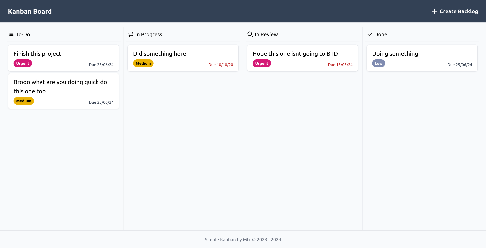

# Simple Kanban
Simple Kanban board for project management

## Features

- Create, update, and delete backlogs
- Drag and drop tasks between columns (To-Do, In Progress, In Review, Done)
- Responsive design for use on both desktop and mobile devices

## Stack Used

- [SvelteKit](https://kit.svelte.dev)
- [Tailwind](https://tailwindcss.com)
- [Skeleton UI](https://www.skeleton.dev)
- [MongoDB](https://www.mongodb.com)
